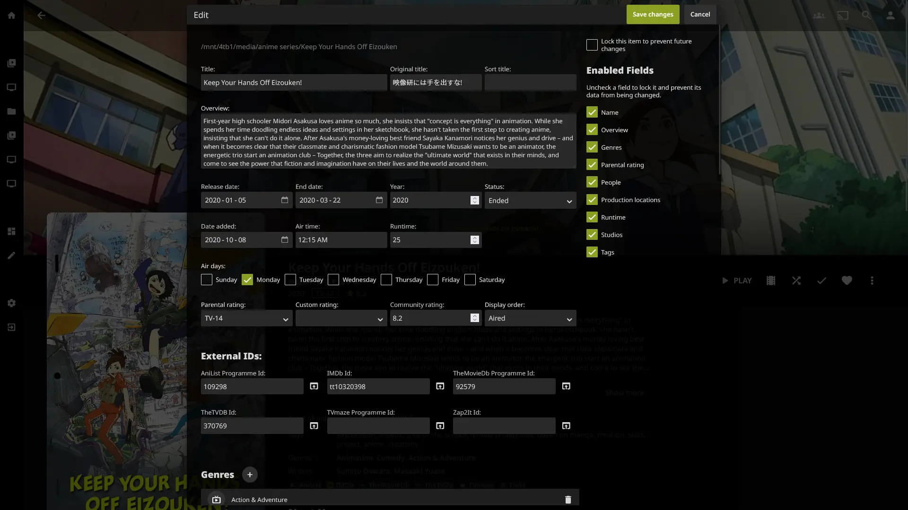
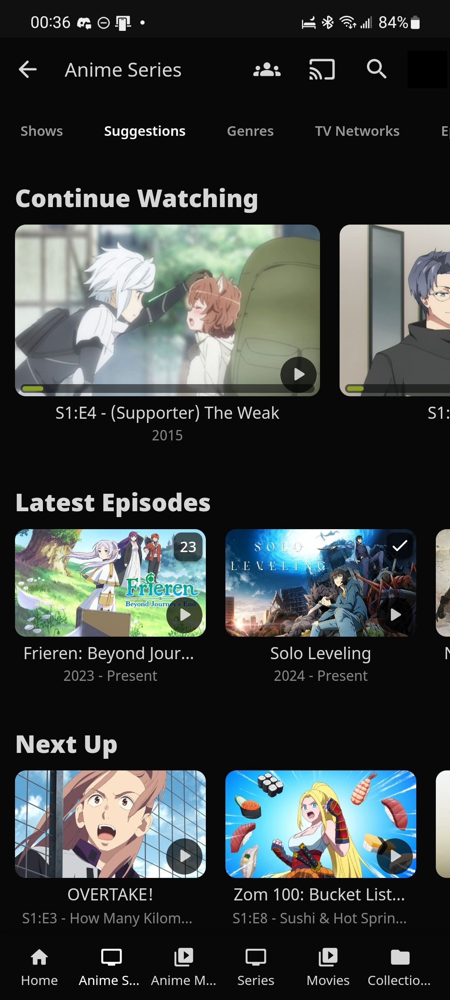

# Rockfin

This project is in an **unreleased** state. Expect bugs and bare minimum QC for commits until it's more feature complete.

## Installation

Currently, all the recommended or "core" CSS is combined into the ["recommended.css"](recommended.css) file in this directory. You can copy-paste that entire file into your Jellyfin CSS box. See how to do that [here](https://jellyfin.org/docs/general/clients/css-customization/).

## Current features

- Compact editing UI for easier changes to your media metadata.
- Always-accessible sidebar for quick navigation.
- Remade mobile interface with bottom navigation.
- Other changes to things that annoyed me. A more comprehensive list will come as it develops.

## Planned features

- More colour options.
- A guide to changing accent colours, so that you don't have to use green.
- Easier install, with options.

## Gallery

These screenshots display designs that may have already changed or be subject to change later.

